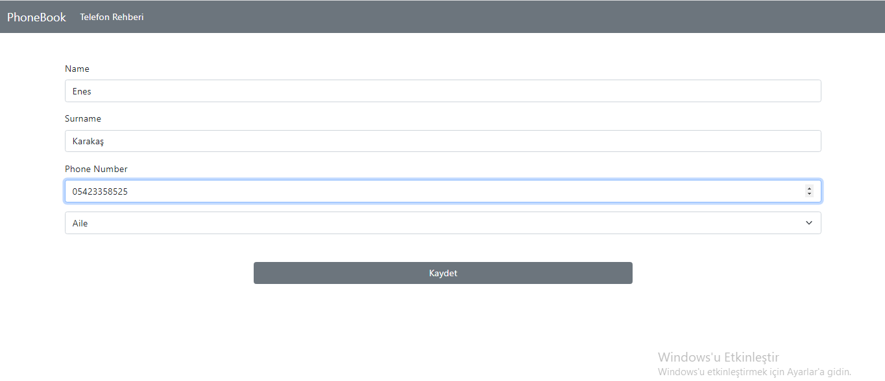
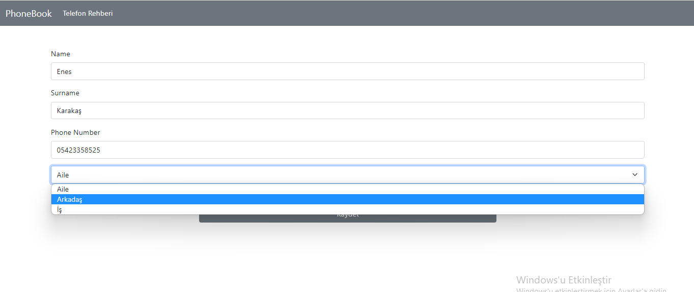
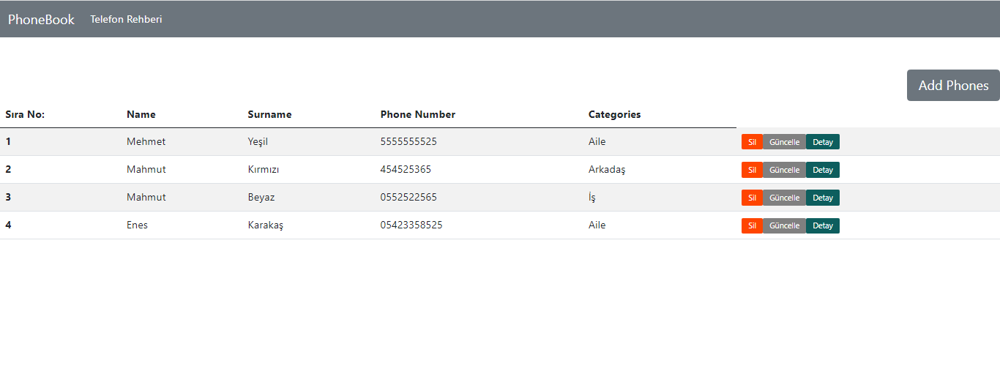
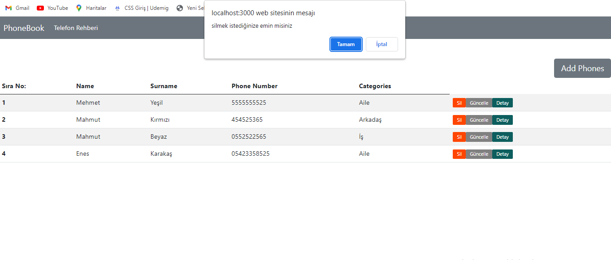

# PHONEBOOK PROJECT

This is a Phonebook application built with React, React-Redux, Redux, React-Router-DOM, JSON-Server, Axios, and Bootstrap.

<h1>Getting Started</h1>

To get started, clone this repository and run the following command to install the required dependencies:

### npm install

After installation, start the JSON-Server API by running the following command:

### npm run server

Finally, start the application by running the following command:

### npm start

<h1>Features</h1>

This library management system application provides the following features:

<ul>
 <li>Add new books to the library</li>
 <li>Edit existing books in the library</li>
 <li>Delete books from the library</li>
 <li>Search for books in the library</li>
 <li>View detailed information about each book</li>
 <li>Responsive design with Bootstrap</li>
</ul>

<h1>Technologies Used</h1>

This application was built using the following technologies:

<ul>
 <li>React</li>
 <li>React-Redux</li>
 <li>Redux</li>
 <li>React-Router-DOM</li>
 <li>JSON-Server</li>
 <li>Axios</li>
 <li>Bootstrap</li>
</ul>

The images of projects are below:

